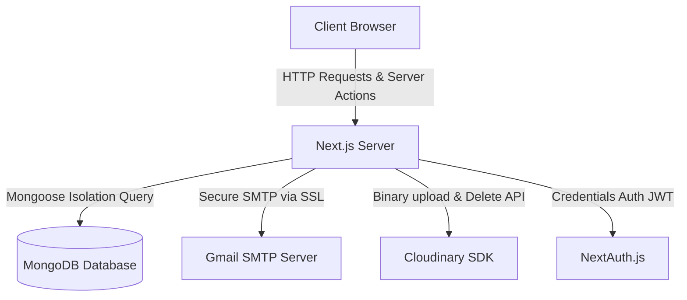
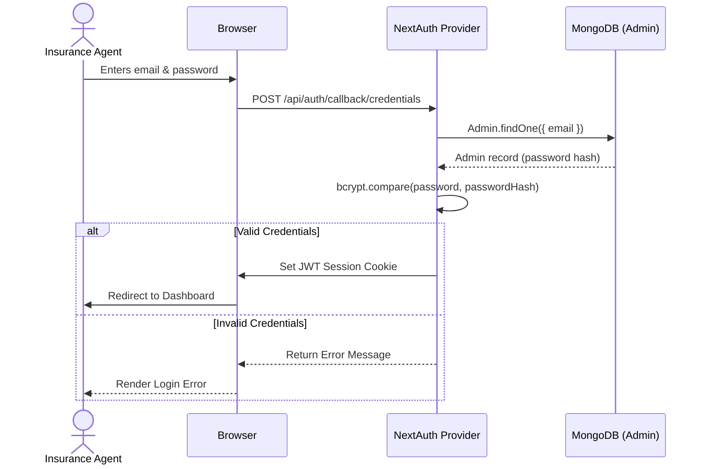

# System Architecture & Technical Design

This document details the engineering architecture, data layer schema, secure request flows, and external integrations of the Insurance Renewal CRM.

---

## System Architecture Overview

The CRM is designed as a secure, monolithic Next.js application using Next.js 15 App Router. The backend communicates directly with MongoDB via Mongoose, uploads documents to Cloudinary, and sends email notifications via Nodemailer SMTP.



---

## Database Schema Design

The database relies on MongoDB. Data integrity is enforced using Mongoose schemas. Every document, policy, and audit log is structurally bound to a user (`Admin`) record using their unique database `ObjectId`.

### 1. Admin Schema (`Admin.ts`)
Stores the authenticated administrator/agent profile details and hashed login credentials.
* `_id` (`ObjectId`, Primary Key)
* `name` (`String`, Required)
* `email` (`String`, Required, Unique, Indexed)
* `mobile` (`String`, Required)
* `passwordHash` (`String`, Required)
* `createdAt` / `updatedAt` (`Date` timestamps)

### 2. Policy Schema (`Policy.ts`)
Holds the policy metadata and sub-documents representing files in the Vault.
* `_id` (`ObjectId`, Primary Key)
* `userId` (`ObjectId`, Foreign Key referencing Admin, Required, Indexed)
* `name` (`String`, Required)
* `policyNumber` (`String`, Required, Unique, Indexed)
* `policyType` (`String` Enum: `Car`, `Health`, `Life`, `Home`, `Travel`, `Other`, Required)
* `issueDate` (`Date`, Required)
* `expiryDate` (`Date`, Required, Indexed)
* `mobileNumber` (`String`)
* `email` (`String`, Indexed)
* `documents` (`Array` of `DocumentItemSchema`)
* `isMuted` (`Boolean`, Default: `false`)

#### DocumentItem Sub-schema
* `url` (`String`, Required)
* `type` (`String` Enum: `PDF`, `Image`, `Other`, Required)
* `label` (`String`)
* `publicId` (`String`)

### 3. AuditLog Schema (`AuditLog.ts`)
Tracks every core action taken in the CRM, including dispatches, uploads, updates, and errors.
* `_id` (`ObjectId`, Primary Key)
* `userId` (`ObjectId`, Foreign Key referencing Admin, Indexed)
* `policyId` (`ObjectId`, Foreign Key referencing Policy, Nullable)
* `action` (`String`, Required)
* `channel` (`String` Enum: `Email`, `WhatsApp`, `System`, Required)
* `recipient` (`String`, Required)
* `status` (`String` Enum: `Success`, `Failed`, Required)
* `details` (`String`)
* `timestamp` (`Date`, Default: `Date.now`)

### Entity-Relationship Diagram

```mermaid
erDiagram
    Admin {
        ObjectId id PK
        String name
        String email UK
        String mobile
        String passwordHash
    }
    Policy {
        ObjectId id PK
        ObjectId userId FK
        String name
        String policyNumber
        String policyType
        Date issueDate
        Date expiryDate
        String mobileNumber
        String email
        DocumentItem documents
        Boolean isMuted
    }
    AuditLog {
        ObjectId id PK
        ObjectId userId FK
        ObjectId policyId FK
        String action
        String channel
        String recipient
        String status
        String details
        Date timestamp
    }
    DocumentItem {
        String url
        String type
        String label
        String publicId
    }
    Admin ||--o{ Policy : owns
    Admin ||--o{ AuditLog : triggers
    Policy ||--o{ AuditLog : logged_for
    Policy *--o{ DocumentItem : contains
```

---

## Security & Tenant Isolation

To prevent critical data leaks where Agent A might view or manipulate records belonging to Agent B:
1. **Scope Checking**: Every Server Action retrieving, updating, or deleting a policy binds the query to the active session user ID:
   ```typescript
   const policy = await Policy.findOne({ _id: policyId, userId: session.user.id });
   ```
2. **No Shared Collections**: Even when executing bulk tasks (e.g. occasion broadcasts), the database query filters records strictly by `userId`:
   ```typescript
   const policies = await Policy.find({ _id: { $in: data.policyIds }, userId: session.user.id });
   ```
3. **Database Migration Script**: On connection startup, the system identifies any orphaned policies or logs lacking a `userId` field and links them to the primary administrator profile to maintain strict structural integrity.

---

## Authentication Flow

Users authenticate via Credentials provider using NextAuth. The session token is stored inside a secure JWT.



---

## External Integrations

### 1. Document Vault (Cloudinary Integration)
Uploads utilize a file buffer streaming method directly into the `uploader.upload_stream` hook.
* **Storage Path**: Assets are stored inside a dedicated folder `insurance_crm_documents`.
* **Resource Clamping**: PDF files are specified as resource type `raw` inside the Cloudinary API. All images are processed as type `auto`.
* **Destruction Pipeline**: Standard deletion triggers:
  1. Retrieve `publicId` and `url`.
  2. Call Cloudinary API's `uploader.destroy(publicId, { resource_type })`.
  3. Pull document item out of Mongoose array.
  4. Save policy and log event to AuditLog.

### 2. Notification Engine (Gmail SMTP)
Standardizes automated alerts using `nodemailer`'s transporter.
* **Transporter Configuration**:
  * **Host**: `smtp.gmail.com`
  * **Port**: `465` (SSL)
  * **Authorization**: Gmail username & 16-character Google App Password.
* **Automated Cron Scheduling**: Triggers from a secure API endpoint `/api/cron/reminders`. If an individual dispatch crashes (e.g. due to connection timeouts), the loop continues, logging the exact error directly to the `AuditLog` collection.
